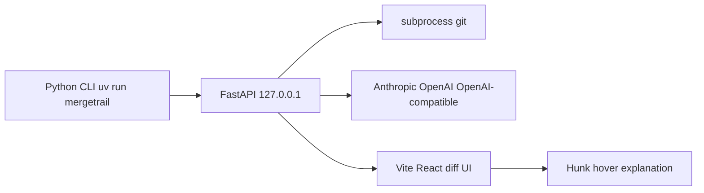

# MergeTrail v1: local GitHub-style diff + AI explanations

**Tagline:** Open-source, agent-agnostic workspace for understanding and reviewing large pull requests.

Three words to keep honest as we build:

- **agent-agnostic** — BYOK for Anthropic, OpenAI, or any OpenAI-compatible endpoint including local. No provider is privileged, nothing is proxied through a service we run.
- **large** — the value shows up at 40+ files. Lazy per-hunk explanation, hunk-hash caching, and fast file navigation are features, not optimizations.
- **workspace** — the UI is the place you sit while reviewing, not a one-shot summary. Review progress (files seen, hunks read) is in scope; bug finding is not.

"Pull request" here is the colloquial name for the change under review. v1 reads a **local branch** and never talks to GitHub. Fetching a PR ref by number (`--pr 1234`) stays post-v1, so no part of the build should assume a forge API.

## Recommendation

**Ship a locally run server + web UI. Do not start as a VS Code extension.**

v1 is a dedicated review surface: file list, unified/split diffs, and per-hunk explanations on hover. That layout is what GitHub's Files tab does well and what VS Code webviews do poorly. Cline/Continue are editor agents; this product is closer to "GitHub PR review, offline, with a narrator."

A later optional extension can be one command: "Open MergeTrail on this branch." That is a launcher, not the product.



## Why not VS Code first

- The job is **understand this branch**, not **edit this file**. Users will compare against `main`, jump files, and read hunk notes. That wants a full page, not a sidebar.
- VS Code already has GitHub Pull Requests, GitLens, and inline blame. An extension here is easy to ignore.
- "Login / bring your own key" and a custom hover-explanation layer are simpler in a normal web app.
- Editor lock-in fights the open-source pitch. A local URL works from Cursor, Zed, JetBrains, or no editor.

OpenHands made the same split: local agent server + canvas UI, with IDE as an optional client. Cline went extension-first because the product *is* the editor loop. MergeTrail is not that.

## What v1 is (and is not)

**Is**
- Open a local repo, pick base (`main` / `develop` / commit) vs head (`HEAD` or a branch)
- GitHub-like file tree + unified/split diff
- AI **summary of each hunk** (what changed, why it likely matters)
- Hover (or a pinned side panel) shows that explanation
- Cache explanations so revisiting a file is free

**Is not**
- Bug finding, security review, or a tracker
- Autonomous edits, apply-patch, or a Devin agent
- Hosted SaaS in v1 (keys and git stay on the machine)

## Auth: be honest about "Login with Claude"

Anthropic does **not** allow third-party apps to offer Claude.ai / Pro / Max subscription login, or to reuse Claude Code OAuth. Products must use **Claude Console API keys** (or Bedrock/Vertex).

v1 provider model:
- **BYOK in the UI**, stored only on disk / OS keychain, never sent anywhere except the chosen provider
- First-class: Anthropic, OpenAI, and any OpenAI-compatible base URL (OpenRouter, Groq, local Ollama)
- Optional later: "Login with Claude Console" via Anthropic's official API OAuth (`ant auth` style), which is **metered API**, not a Max subscription

Do not scrape or proxy Claude Code tokens. That will get the project banned and users burned.

## Language: full-stack FastAPI + React

This is a **full-stack personal project**. Both sides are first-class, not "Python with a leftover UI" or "React with a thin API."

- **Python:** CLI, git, Pydantic models, FastAPI, SSE, BYOK providers, hunk cache
- **React:** GitHub-like review chrome, file tree, unified/split diffs, hunk hover, settings

That is the stack you want on a resume: you designed the API *and* the product UI.

**Do not go Python-only for the UI.** Streamlit, Gradio, NiceGUI, and Reflex will not look like GitHub's Files tab.

**Do not use GitPython as the source of truth.** Spawn real `git` via `asyncio.create_subprocess_exec` so merge-base, renames, binaries, and three-dot diffs match GitHub.

| Layer | Choice | Why |
|---|---|---|
| Packaging | `uv` + `pyproject.toml` | Current Python, `uvx mergetrail` later |
| CLI / server | Typer + FastAPI + Uvicorn on `127.0.0.1` | Opens browser, serves API and the built UI |
| Models | Pydantic v2 | Shared contract: review, file, hunk, settings |
| Git | subprocess `git` | Correct PR-style diffs |
| LLM | Official Anthropic/OpenAI SDKs, or [Pydantic AI](https://ai.pydantic.dev) / LiteLLM | Streaming, BYOK, OpenAI-compatible base URLs |
| Cache / keys | `~/.mergetrail/` (`0600` for secrets) | Local-only |
| UI | Vite + React + TypeScript + Tailwind | Product surface you can demo |
| Diff view | [`@git-diff-view/react`](https://github.com/MrWangJustToDo/git-diff-view) or Monaco DiffEditor | Hunk/split/unified rendering |
| Client data | TanStack Query | File list, lazy hunk explain, cache-aware refetch |

What the Python side should show:

- Typed Pydantic request/response models that the UI consumes as-is
- Async FastAPI + SSE for hunk explanations
- Careful git subprocess wrapper (timeouts, cwd, no shell)
- Provider-agnostic explain pipeline and on-disk cache keyed by hunk hash
- A real CLI: `mergetrail`, `mergetrail --base main`, `--port`

What the React side should show:

- A review layout that feels like GitHub Files (header, file tree, diff pane, explanation)
- Precise hunk hit-targets and a hover / sticky explanation panel
- Unified vs split, keyboard file navigation, empty/binary/error states
- Typed API client matching the Pydantic schemas
- Settings UI for BYOK and model picker (keys never leave the local server)

Repo layout:

```
src/mergetrail/
  cli.py        # Typer entry point
  api/          # FastAPI app + routes
  git/          # subprocess git, diff + hunk parsing
  explain/      # providers, prompts, cache
  static/       # built UI, generated at build time
ui/             # Vite + React + TypeScript source
tests/          # pytest: git parsing, hunk hashing, prompt/cache
```

Keep the Python side at `src/mergetrail/` rather than a top-level `api/`: it is an installable distribution holding the CLI, git layer, explain pipeline, and routes, and `src/<package>/` is what hatchling, ruff, pytest, and `uvx mergetrail` expect. `api` is accurate as a module *inside* the package. The built UI is copied into `src/mergetrail/static/` so one wheel ships both halves.

The repo today is empty except [LICENSE](LICENSE). No existing code to extend.

## Core git model

Treat a review as `base...head` (three-dot), the same as GitHub PRs:

1. `git rev-parse --show-toplevel`
2. `git merge-base <base> <head>`
3. `git diff --name-status -M <merge-base> <head>`
4. `git diff -U3 -M <merge-base> <head> -- <file>`
5. Split into hunks (`@@ -a,b +c,d @@`) and hash each hunk (`sha256` of file + hunk header + body)

That hash is the cache key. Same branch, same hunk, no second API call.

Skip binaries and lockfile monsters by default (show "binary" / "generated, skip AI").

## AI behavior for v1

One job: **explain the hunk in plain language**.

- Input: file path, language, hunk, optional 20–40 lines of surrounding file from `head`
- Output: 2–4 sentences. No "possible bugs", no severity, no suggested patches
- Trigger: lazy as the file scrolls into view (cheaper than summarizing the whole PR up front)
- UI: gutter mark on explained hunks; hover popover + optional sticky panel so it is usable without hovering

Prompt must be tight so the tool stays an explainer, not a reviewer.

## UX sketch

- Left: file tree with add/modify/delete + "explained" ticks
- Center: GitHub-like diff (unified default, split toggle)
- Right or overlay: current hunk explanation
- Header: repo name, `base ← head`, commit count, tokens/cost estimate, model picker

Looks like GitHub Files. Feels faster because every hunk has a caption.

## How we build: six parts, you commit

Code one **part** at a time, then stop. You commit by hand so history looks like a person growing the app. I will not commit unless you ask.

Each part must be demoable on its own. Suggested messages (edit freely):

**Part 1 — Scaffold**
- `uv`, `pyproject.toml`, `src/mergetrail/`, README, `.gitignore`
- Package imports; no real behavior yet
- Commit: `Add Python project scaffold with uv`

**Part 2 — Git**
- Subprocess `git`, merge-base, file list, per-file patch, hunk split + hash
- pytest on a fixture repo
- Commit: `Read local branch diffs with git merge-base`

**Part 3 — API + CLI**
- FastAPI on `127.0.0.1`, Pydantic models, `GET /review`, `/files`, `/files/{path}`
- CLI: `mergetrail --base main`
- curl-able; no polished UI yet
- Commit: `Expose local review data over FastAPI`

**Part 4 — Review UI**
- Vite + React + Tailwind: header, file tree, unified/split diff
- Looks like GitHub Files; no explanations
- Commit: `Add a GitHub-style UI for local branch diffs`

**Part 5 — Hunk panel**
- Hunk hit-targets, hover + sticky panel, empty/loading copy
- API already has hunk ids; still no model calls
- Commit: `Show a side panel for each diff hunk`

**Part 6 — Explain**
- Settings for BYOK, one provider first, lazy explain, `~/.mergetrail` cache
- Prompt stays explainer-only
- Commit: `Explain diff hunks with a user-supplied API key`

Stop after Part 6. Extra providers and skip-large-file rules can be a later commit if needed.

When you say to start, I implement **Part 1 only**, then wait for your commit.

## Later, not v1

- Thin VS Code/Cursor command that runs the CLI on `workspace.uri`
- Fetch a GitHub PR ref and review it locally
- Shared/team cache
- Finding bugs or "approve/request changes"
